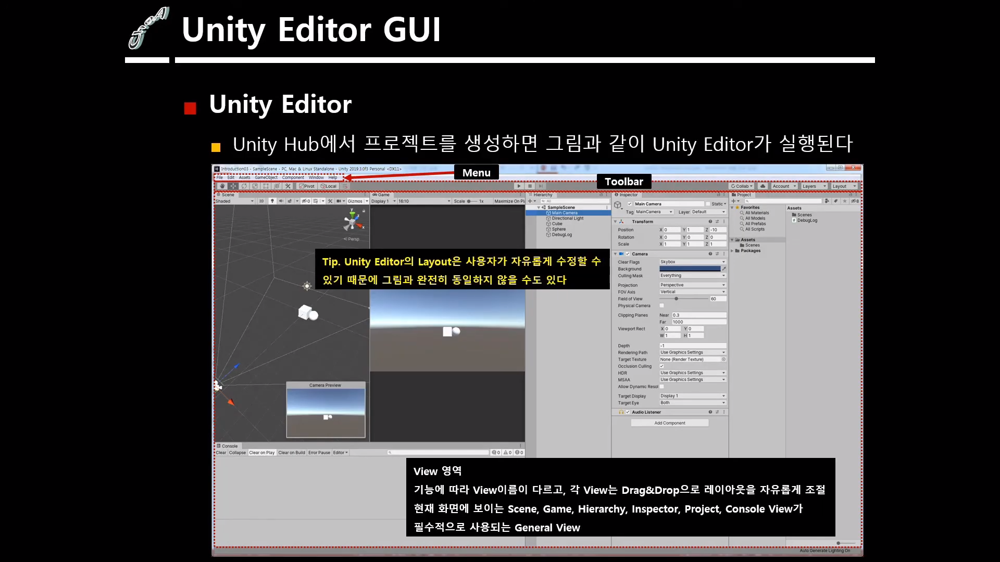
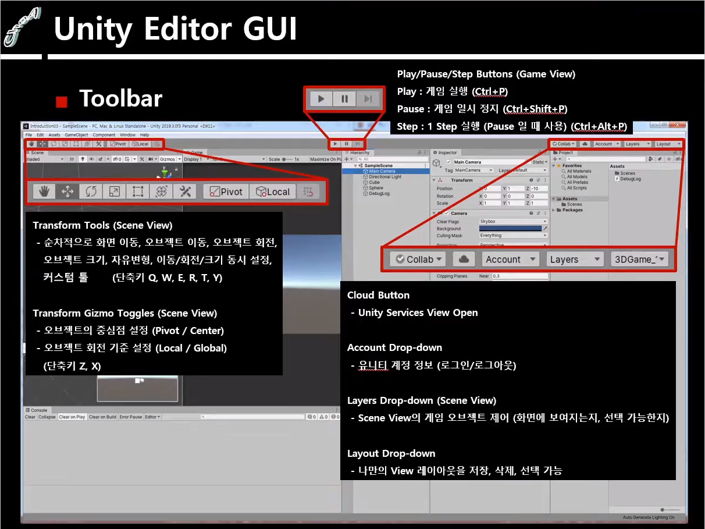
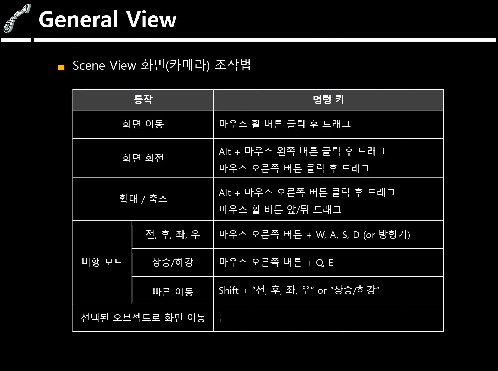
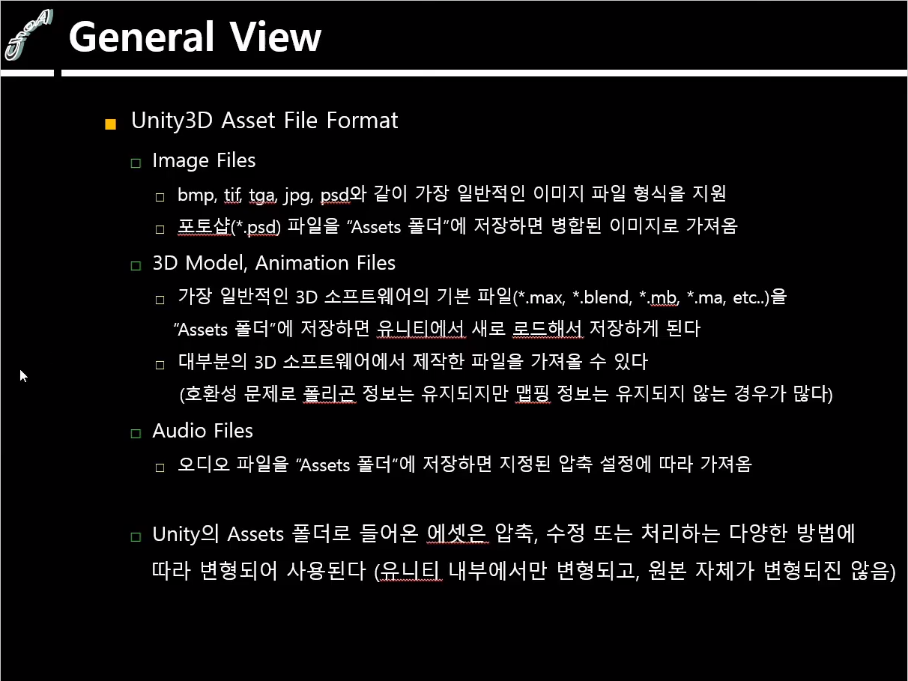

## Unity Editor Interface

### 상단 메뉴

#### 1. File

- Build Setting : 실행 파일로 빌드

#### 2. Edit

> 현재 프로젝트에 다양한 설정이 가능

- Project Setting : 단축키가 그래픽 옵션 등을 설정할 수 있다

#### 3. Assets

- Package : 유니티 내부에 있는 여러 개의 파일을 하나로 묶어서 다른 사람에게 전달하거나 받을 때 사용하는 묶음

#### 4. Game Object

- Game Object : 유니티 상에서 하나의 물체, 사물을 뜻하는 객체

#### 5. Component

> 게임 오브젝트에 부착해서 사용하는 하나의 속성

- 물리, 사운드 재생, 충돌 박스, 렌더링 등

#### 6. Window Menu

> Unity의 뷰를 열 수 있는 메뉴

### 툴바

#### 1. Scene View (Ctrl + 1)

#### 2. Project View

> 모든 리소스를 관리하는 뷰
>
> 프로젝트에 영향을 주려면 Hierarchy에 있어야 한다

##### 1.1 사용 가능한 파일의 확장자들

