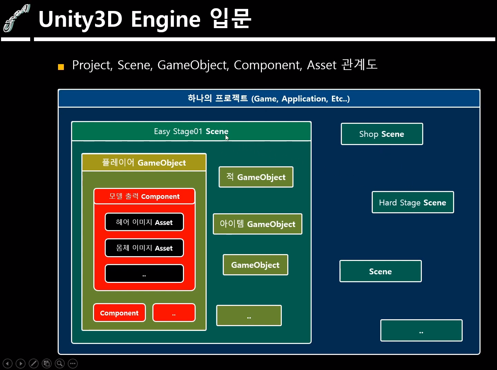

## Game Object, Component

### 유니티 기본 용어

#### 1. Project

> 하나의 게임, 콘텐츠, 어플리케이션

#### 2. 씬

> 게임의 장면이나 상태를 저장하는 단위

- 하나의 거대한 게임을 씬 단위로 관리하며, 코드를 이용해 이동이 가능
    - 인트로, 로비, 메뉴 등을 씬 단위로 관리한다

- 씬이 바뀌게 되면 이전 씬에 존재하던 모든 정보를 삭제하고 넘어간다

#### 3. Game Object, Component

##### 3.1 Game Object

> 씬에 배치되는 하나의 물체를 지칭하는 단위

- Hierarchy에 보이는 모든 오브젝트

- 위치, 회전, 크기를 제어하는 Transform 컴포넌트를 기본 보유

- 컴포넌트를 묶어서 관리하고 접근할 수 있는 수단

##### 3.2 Component

> 게임 오브젝트에 부착할 수 있는 C# 스크립트 파일

- 게임 오브젝트에 여러 기능을 부여
    - 이동, 공격, 도망과 같은 행위는 직접 작성한 C# 스크립트 파일을 컴포넌트로 사용할 때 가능

- Sprite Renderer 컴포넌트 : 2차원의 이미지를 화면에 출력

- Mesh Renderer 컴포넌트 : 3차원의 오브젝트(물체)를 화면에 출력

- Audio Source 컴포넌트 : AudioClip 변수에 등록된 사운드 에셋을 재생

#### 4. Asset

> 프로젝트 내부에서 사용하는 모든 리소스를 지칭하는 단위

- Audio, 3D Model, Animation, Texture, Script, Prefab, ...

#### 5. Prefab

> Hierarchy View에 있는 Game Object를 파일 형태로 저장하는 단위

- 게임 중간에 생성되는 Game Object를 prefab으로 저장하고 사용

- 장점
    - 동일한 게임 오브젝트를 여러 Scene이나 게임 월드 특정 장소에 배치할 때 Project View에 저장되어 있는 Prefab을 Drag & Drop하여 배치할 수 있다

    - 기획상의 변경이 있을 때 프리팹 원본을 갱신하게 되면 모든 씬에 복사되어 배치된 게임 오브젝트들도 원본과 동일하게 업데이트 된다

### 게임 오브젝트 종류

1. 빈 오브젝트 (Empty Object)

    - Transfrom 컴포넌트만 있는 오브젝트

    - 게임에 보이지 않지만 게임의 여러 요소를 처리하는 오브젝트를 만들 때 주로 사용

    - 적을 주기적으로 생성하는 Spawner, 스테이지가 클리어 되는 조건을 관리하는 StageController 등

2. 3D Object

    - Cube, Sphere 등 기본적인 도형 오브젝트
        - Cube : 한 변의 길이가 1이고, 6개의 면으로 이루어진 육면체
            - Mesh Filter : 3차원 오브젝트의 외형

            - Mesh Renderer : 3차원 오브젝트의 표면 색상

            - Box Collider : 충돌 범위

    - 3차원 게임을 제작할 때 필요한 모델은 외부 프로그램에서 제작하여 가져온다

    - Text : 3차원에 텍스트를 나타내기(New)

    - Ragdoll : 인형처럼 흐느적거리게 만드는 오브젝트

    - Terrain : 지형

    - 3D Text : 3차원 텍스트를 표현(Legacy)

3. 2D Object

    - 게임 화면에 배치할 수 있는 2D 오브젝트

    - Sprite : 게임 화면에 2D 이미지를 보이게 하는 게임 오브젝트
        - Sprite Renderer : 게임 화면에 2D 이미지를 출력
            - Sprite 변수에 적용된 에셋(이미지)를 화면에 출력

    - Sprite Mask : Sprite 오브젝트의 특정 부분을 보이거나 보이지 않게 할 때 사용

    - Tilemap : 타일 형태의 2차원 맵을 제작할 때 사용

4. Effect : 게임에 사용되는 여러 효과, 무기의 잔상, 선 그리기와 같은 효과 오브젝트들

5. Audio : 게임 내에서 재생되는 사운드와 관련된 오브젝트들

6. Video : 동영상을 재생하는 오브젝트

7. UI : 사용자가 게임과 상호작용 할 수 있는 GUI 오브젝트들

    - Text, Image : 텍스트, 이미지 출력을 목적으로 하는 상호작용이 불가능한 오브젝트

    - Button, Toggle, Slider, Dropdown, Input Field : 상호작용이 가능한 오브젝트

    - Canvas, Panel, Scroll View : UI를 화면에 그리고 상호작용을 가능하게 하기 위해 필요한 오브젝트

8. Camera : 게임 월드를 볼 수 있는 눈 역할

    - 씬에 최소 1개 이상 존재해야 함

    - Audio Listener : 오디오 소스 컴포넌트가 내는 소리를 듣는 역할

    - Clear Flags : 오브젝트가 존재하지 않는 빈 배경을 어떻게 채울지 결정하는 요소

        - 주로 2D는 Solid Color, 3D는 Skybox 사용

        - Depth only or Don't Clear : 오브젝트 이동 시 기존 위치의 잔상이 남는다

    - Projection : 카메라의 시점

        - Orthographic : 2D 모드
            - Size : 카메라 시야 범위

        - Perspective : 3D 모드
            - Field of View : 카메라 시야 범위

            - FOV Axis : 시야 범위를 넓히는 방향(Vertical, Horizontal)

    - Clipping Planes : 카메라가 오브젝트를 볼 수 있는 시야 거리

        - Near (default 0.3) : 최소 시야 거리

        - Far (default 100) : 최대 시야 거리

    - Viewport Rect : 카메라가 본 것을 화면에 출력하는 영역 설정 (0 ~ 1)
        - x, y는 출력을 시작하는 위치 좌표

        - width, height는 출력하는 화면 크기

9. Light : 현실 세계의 빛 역할

    - 완전한 암흑 공간을 만들고 싶을 때
        - Window - Rendering - Lighting Settings - Lighting View

        - 환경광과 주변광을 어둡게 설정

        - 카메라의 Clear Flags를 검은색으로 설정

    - Type : 빛의 종류 설정

        - Directional Light : 방향이 중요한 빛. 모든 오브젝트에게 동일한 방향으로 빛을 제공

        - Point Light : 구 형태로 방사되는 빛
            - 전구, 모닥불 등

        - Spot Light : 원뿔 형태로 뻗어나가는 빛
            - 가로등 등

        - Area Light : 오브젝트의 위치를 기준으로 전방 방향으로만 방추되는 빛

            - Baked 모드에서만 사용 가능

    - Mode : 빛의 연산을 실시간인지 미리 계산해두고 쓰는지 결정

        - Realtime : 실시간 연산

        - Baked : 미리 연산해둔 값을 사용
            - 빛의 영향을 받는 모든 Game Object의 Static 옵션ㅇ르 Contribute GI로 설정

            - Window - Rendering - Lighting Settings - Genereate Lighting으로 빛 데이터 Baked

        - Mixed : Realtime과 Baked를 섞어 사용

    - Intensity : 빛의 세기

    - Shadow Type : 빛을 받은 오브젝트의 그림자 설정

    - Cookie & Cookie Size : 빛의 모양과 크기를 원하는 대로 조정
        - 하늘에 비친 배트맨 문양 등

